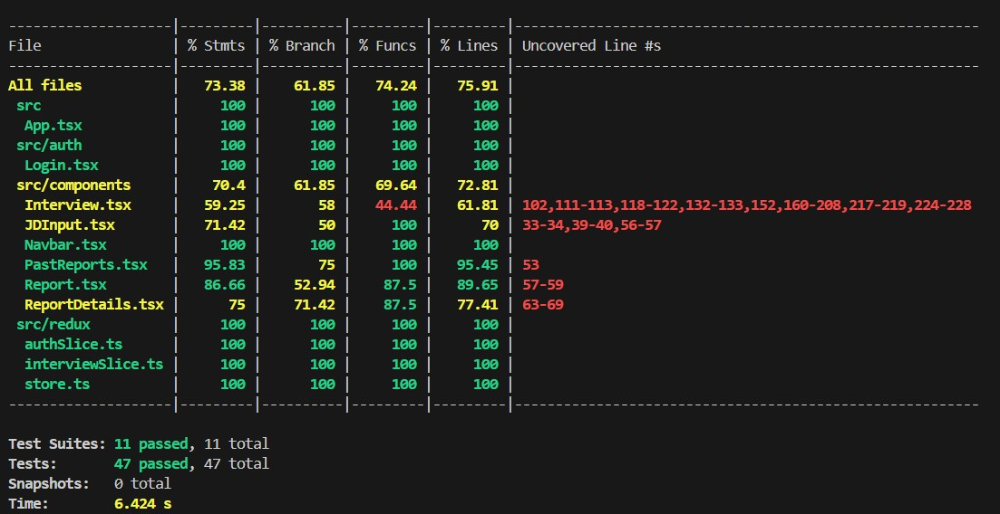

# AudioInterviewer Frontend  
## Comprehensive Project Report & README

### Table of Contents
- [1. Overview](#1-overview)
- [2. Features](#2-features)
- [3. Project Structure](#3-project-structure)
- [4. Core Functionality](#4-core-functionality)
  - [4.1 Authentication Flow](#41-authentication-flow)
  - [4.2 Interview Workflow](#42-interview-workflow)
  - [4.3 Reports & PDF/Audio Exports](#43-reports--pdfaudio-exports)
- [5. Testing](#5-testing)
  - [5.1 Test Strategy](#51-test-strategy)
  - [5.2 Running Tests](#52-running-tests)
  - [5.3 Coverage Report](#53-coverage-report)
- [6. Running the Project](#6-running-the-project)
  - [6.1 Local Development](#61-local-development)
  - [6.2 Dockerization](#62-dockerization)
- [7. Environment Variables & Configuration](#7-environment-variables--configuration)

## 1. Overview

**AudioInterviewer Frontend** is a React + Redux-based single-page application that enables users to simulate job interviews with audio and text-based questions, generate session reports, and export session data as PDFs or audio files. It is containerized with Docker for consistent deployment and leverages modern front-end best practices for state, API, and user flow management.

## 2. Features

- **Authentication**: Secure email-based login and session management.
- **Interview Workflow**: Stepwise question/answer UI with audio input/output.
- **Report Generation**: After the interview, generate and view rich transcript and analytics.
- **Export Options**: Download session summaries as PDF; access audio answers.
- **Past Reports**: View, search, and deep-dive into prior interviews.
- **Robust Testing**: Extensive unit and integration test coverage for logic and UI states.
- **Containerized Deployment**: Easily run and orchestrate with Docker Compose.

## 3. Project Structure

```

src/
  App.tsx
  components/        # UI components (Login, Navbar, Interview, Reports etc)
  redux/             # Redux slices (authSlice, interviewSlice, etc.)
  api/               # API utilities 
  auth/              # Login.tsx & protected route logic
  tests/             # Unit tests            
Dockerfile           # Frontend container specification
docker-compose.yml   # Compose file 
public/              # Static assets (index.html, favicon)
README.md            # This documentation/report
```

## 4. Core Functionality

### 4.1 Authentication Flow
- **Login**:
  - Users enter email credentials.
  - State managed by `authSlice`.
  - Post-login, user info persists for the session.
- **Protected Routes**:
  - Only authenticated users can access interview, report, and report details routes.
  - Redirection logic ensures unauthorized users are routed to login.

### 4.2 Interview Workflow
- **JD Input**:
  - User begins by submitting the Job Description (JD).
  - Triggers API request (mocked in dev/test) for interview session initialization.
- **Question/Answer Flow**:
  - Questions progress sequentially.
  - Answers can be typed or input via microphone/audio APIs.
  - State managed in `interviewSlice` (immutable/atomic updates).
- **Session Handling**:
  - Handles errors (e.g., API/network failures) with alerts to the user.
  - Session data is utilized to render subsequent components and generate reports.

### 4.3 Reports & PDF/Audio Exports
- **Report Generation**:
  - Summarizes each session’s transcript, responses, and analysis.
  - Allows for PDF download (via `html2pdf.js`) and audio playback.
- **Past Reports**:
  - Lists all previous interviews.
  - Allows navigation to plat reports with full session details and audio answers.

## 5. Testing

### 5.1 Test Strategy

- **Unit Tests**: Validate Redux slices and reducers (`authSlice`, `interviewSlice`).
- **Integration/Component Tests**: Simulate user flows, UI states, API calls with React Testing Library.
- **Mocking**: All side effects (API, audio, PDF generation, navigation) are mocked for stable, deterministic testing.

#### Key Areas Covered:
- Routing and routing protection logic
- UI state for all critical components (loading, errors, success)
- Redux state management and side effects
- API and side-effect mocking: navigation, pdf/audio, browser APIs

### 5.2 Running Tests

All tests use Jest and React Testing Library.

```sh
# Install dependencies (if not already done)
npm install

# Run full test suite
npm test

# For continuous watch mode (optional)
npm test -- --watchAll
```

### 5.3 Coverage Report

```sh
# Generate code coverage report (HTML summary in /coverage)
npm run test:coverage

Coverage report :-  

# View summary in terminal, full report in coverage/lcov-report/index.html
```

## 6. Running the Project

### 6.1 Local Development

```sh
# 1. Install dependencies
npm install

# 2. Start the local development server (default: http://localhost:3000)
npm start
```

### 6.2 Dockerization

#### Building with Docker

```sh
# 1. Ensure the 'app-network' Docker network exists (only needed once)
docker network create app-network

# 2. Build and run using Docker Compose
docker-compose up --build

# Access the frontend at http://localhost:8080
```

#### Notes:
- The app container will be named `audio-interviewer-frontend`.
- Container port 80 is mapped to host port 3000 for development convenience.

## 7. Environment Variables & Configuration

- The frontend can be configured to use specific API endpoints via `.env` or Compose `environment` keys.
- **Common variables** (example):
  ```
  REACT_APP_API_URL=http://localhost:7080/api
  ```
- To add variables, update `.env` at the project root and restart the development server or rebuild the container.


## Quick Summary Table

| Task                         | Command/Action                                    |
|------------------------------|---------------------------------------------------|
| Install dependencies         | `npm install`                                     |
| Start dev server             | `npm start`                                       |
| Run all tests                | `npm test`                                        |
| Coverage report              | `npm run test:coverage`                          |
| Build & run Docker Compose   | `docker compose up --build`                       |             |
| Expose on http (Docker)      | visit [http://localhost:8080](http://localhost:8080) |

